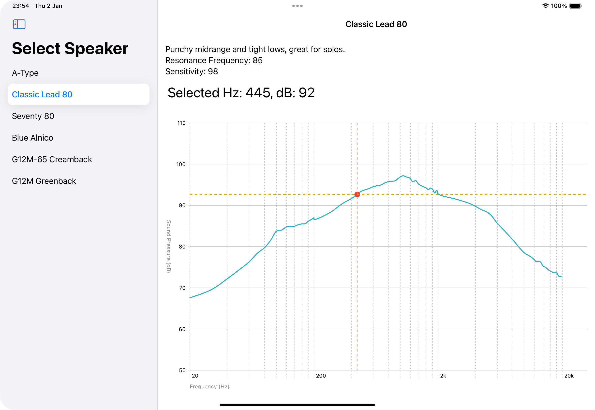

# Speaker frequency response

This app is for experimenting with the SwiftUI Charts framework. 
I created a Guitar Speakers Frequency Graph that allows user to select a point and view detailed information about Frequency (Hz) and Sound Pressure (dB).

